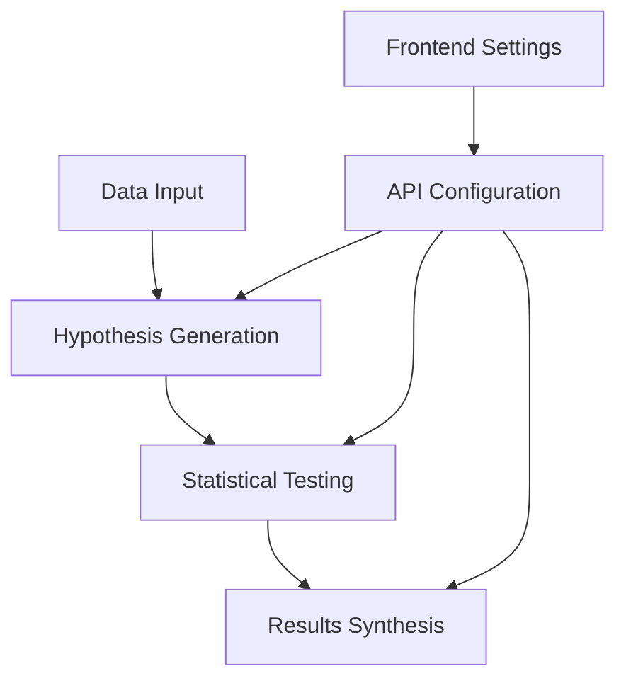

# Hypothesis Forge

An AI-powered tool that automatically generates and tests hypotheses on data, providing actionable insights through statistical analysis with real-time streaming responses.

## Overview

Hypothesis Forge analyzes your data and generates hypotheses that you can test. It then automatically tests them and provides detailed results with statistical significance, all powered by a FastAPI backend with streaming LLM responses.



## Features

### Core Functionality
- **Automated Hypothesis Generation**: Creates relevant hypotheses based on data context and audience
- **Statistical Testing**: 
  - Automatic selection of appropriate statistical tests
  - Support for t-tests, chi-square, correlation significance tests
  - P-value calculation and interpretation
  - Server-side Python execution for reliable results

### User Experience
- **Real-time Streaming**: See responses generate in real-time as the AI processes your data
- **Interactive Interface**:
  - Dynamic results visualization with live updates
  - Dark mode support
  - Mobile-responsive design
  - "Run All" feature to test multiple hypotheses at once
  - Result synthesis for actionable insights
- **Configurable API Settings**:
  - Frontend settings modal for API configuration
  - Support for any OpenAI-compatible API endpoint
  - Secure localStorage for API credentials
  - Default integration with LLM Foundry

### Data Support
- **Multiple Data Formats**:
  - CSV files
  - SQLite databases (.sqlite3, .sqlite, .db, .s3db, .sl3)
  - Support for various data types (numeric, categorical, temporal)
- **Demo Datasets**: Pre-configured datasets for immediate experimentation

## Architecture

### Backend (FastAPI)
- **uv-compatible**: Uses PEP 723 inline dependency specification
- **Streaming responses**: Real-time LLM response streaming via Server-Sent Events
- **Type safety**: Full type hints with Pydantic models
- **Secure execution**: Server-side Python code execution in controlled environment
- **API endpoints**:
  - `/upload` - File upload and data processing
  - `/generate-hypotheses` - Streaming hypothesis generation
  - `/test-hypothesis` - Streaming hypothesis testing with multi-phase responses
  - `/synthesize` - Streaming results synthesis

### Frontend
- **Modern JavaScript**: ES6+ with native fetch and streaming APIs
- **Settings management**: localStorage-based API configuration
- **Progressive rendering**: Content appears as it streams from the backend
- **Responsive design**: Bootstrap 5 with dark mode support

## Quick Start

### Prerequisites
- Python 3.8+ with uv installed
- Any OpenAI-compatible API access (LLM Foundry, OpenAI, etc.)

### Installation & Setup

1. **Clone the repository:**
```bash
git clone https://github.com/prudhvi1709/hypoforge-python.git
cd hypoforge-python
```

2. **Run with uv (recommended):**
```bash
uv run app.py
```

Or traditional setup:
```bash
pip install fastapi uvicorn python-multipart pandas scipy numpy aiohttp
python app.py
```

3. **Open in browser:**
   - Navigate to `http://localhost:8000`
   - Click the Settings (⚙️) button in the navigation
   - Configure your API settings:
     - **API Base URL**: `https://llmfoundry.straive.com/openai/v1` (default)
     - **API Key**: Your API key
     - **Model Name**: `gpt-4.1-nano` (default)

4. **Start analyzing:**
   - Select a demo dataset or upload your own CSV/SQLite file
   - Watch hypotheses generate in real-time
   - Test hypotheses and see streaming analysis
   - Synthesize results for actionable insights

## Usage

### Basic Workflow
1. **Configure API Settings**: Click the gear icon and enter your API credentials
2. **Load Data**: Select a demo dataset or upload your own file
3. **Generate Hypotheses**: Watch as the AI generates relevant hypotheses in real-time
4. **Test Hypotheses**: Click "Test" on any hypothesis to see streaming analysis
5. **Review Results**: See statistical analysis, p-values, and plain English summaries
6. **Synthesize Insights**: Click "Synthesize" to get actionable recommendations

### Streaming Experience
- **Hypothesis Generation**: See JSON content build up as hypotheses are created
- **Hypothesis Testing**: Three-phase streaming:
  1. Analysis code generation
  2. Statistical execution results
  3. Plain English summary
- **Results Synthesis**: Watch markdown recommendations appear progressively

## Technical Stack

### Backend Dependencies (inline with uv)
- **FastAPI**: Modern async web framework
- **uvicorn**: ASGI server for production
- **pandas**: Data manipulation and analysis
- **scipy**: Statistical computing
- **numpy**: Numerical computing
- **aiohttp**: Async HTTP client for LLM API calls

### Frontend Dependencies (CDN)
- **Bootstrap 5**: UI framework and responsive design
- **Bootstrap Icons**: Icon system
- **d3.js**: Data processing and CSV parsing
- **Marked**: Markdown parsing and rendering
- **Highlight.js**: Code syntax highlighting

### Development
- **Type Safety**: Full type hints throughout Python code
- **Error Handling**: Comprehensive error handling with user-friendly messages
- **Security**: API keys stored client-side, never transmitted to backend
- **Performance**: Streaming responses for immediate feedback

## Configuration

### API Settings
Configure through the frontend settings modal:
- **API Base URL**: Any OpenAI-compatible endpoint
- **API Key**: Your authentication token
- **Model Name**: The LLM model to use

Settings are stored securely in browser localStorage and never sent to the backend server.

### Environment
No server-side environment variables needed. All configuration is handled through the frontend interface.

## Demo Datasets

Included datasets for immediate experimentation:
- **EHR Data**: Electronic health records for pharmaceutical analysis
- **Tourist Spend**: Tourism economic data
- **Card Transactions**: Financial transaction patterns
- **Employee Data**: HR and workforce analytics
- **Marvel Powers**: Character abilities analysis
- **World Cities**: Geographic and demographic data
- **NBA Games**: Sports statistics and performance
- **Craft Beer**: Brewery and product analysis
- **Atherosclerosis**: Medical research data

## License

[MIT](LICENSE)

## Contributing

1. Fork the repository
2. Create a feature branch
3. Make your changes
4. Test with `uv run app.py`
5. Submit a pull request

## Support

For issues and questions:
- GitHub Issues: [Report bugs or request features](https://github.com/prudhvi1709/hypoforge-python/issues)
- Documentation: This README and inline code documentation