# Hypothesis Forge

An AI-powered tool that automatically generates and tests hypotheses on data, providing actionable insights through statistical analysis with real-time streaming responses.

## Quick Start

```bash
# Install with uv
uv run git+https://github.com/prudhvi1709/hypoforge-python.git

# Or clone and run locally
git clone https://github.com/prudhvi1709/hypoforge-python.git
cd hypoforge-python
uv run app.py
```

Open `http://localhost:8000`, configure API settings (⚙️), and start analyzing data.

## Overview


Hypothesis Forge analyzes your data and generates hypotheses that you can test. It then automatically tests them and provides detailed results with statistical significance, all powered by a FastAPI backend with streaming LLM responses.

```mermaid
flowchart LR
    subgraph "👤 User Actions"
        A[Upload Data<br/>CSV/SQLite/URL]
        B[Configure API<br/>Settings]
    end
    
    subgraph "🤖 AI Processing"
        C[Generate<br/>Hypotheses]
        D[Test Each<br/>Hypothesis]
        E[Summarize<br/>Results]
    end
    
    subgraph "💾 Data & Storage"
        F[Load & Process<br/>Data Files]
        G[Store Sessions<br/>Temporarily]
    end
    
    %% Simple User Flow
    A --> F
    F --> C
    C --> D
    D --> E
    B -.-> C
    B -.-> D
    
    %% Storage Flow
    F --> G
    G --> D
    
    %% Styling for clarity
    classDef userAction fill
    classDef aiProcess fill
    classDef dataStore fill
    
    class A,B userAction
    class C,D,E aiProcess
    class F,G dataStore
```



## Features

### Core Functionality
- **Automated Hypothesis Generation**: Creates relevant hypotheses based on data context and audience
- **Statistical Testing**: 
  - Automatic selection of appropriate statistical tests
  - Support for t-tests, chi-square, correlation significance tests
  - P-value calculation and interpretation
  - Server-side Python execution for reliable results

### User Experience
- **Real-time Streaming**: See responses generate in real-time as the AI processes your data
- **Interactive Interface**:
  - Dynamic results visualization with live updates
  - Dark mode support
  - Mobile-responsive design
  - "Run All" feature to test multiple hypotheses at once
  - Result synthesis for actionable insights
- **Configurable API Settings**:
  - Frontend settings modal for API configuration
  - Support for any OpenAI-compatible API endpoint
  - Secure localStorage for API credentials
  - Default integration with LLM Foundry

### Data Support
- **Multiple Data Formats**:
  - CSV files
  - SQLite databases (.sqlite3, .sqlite, .db, .s3db, .sl3)
  - Support for various data types (numeric, categorical, temporal)
- **Demo Datasets**: Pre-configured datasets for immediate experimentation

## Architecture

### Backend (FastAPI)
- **uv-compatible**: Uses PEP 723 inline dependency specification
- **Streaming responses**: Real-time LLM response streaming via Server-Sent Events
- **Type safety**: Full type hints with Pydantic models
- **Secure execution**: Server-side Python code execution in controlled environment
- **API endpoints**:
  - `/upload` - File upload and data processing
  - `/generate-hypotheses` - Streaming hypothesis generation
  - `/test-hypothesis` - Streaming hypothesis testing with multi-phase responses
  - `/synthesize` - Streaming results synthesis

### Frontend
- **Modern JavaScript**: ES6+ with native fetch and streaming APIs
- **Settings management**: localStorage-based API configuration
- **Progressive rendering**: Content appears as it streams from the backend
- **Responsive design**: Bootstrap 5 with dark mode support

## Usage

1. **Configure API Settings**: Click the gear icon and enter your API credentials
2. **Load Data**: Select a demo dataset or upload your own file  
3. **Generate Hypotheses**: Watch as the AI generates relevant hypotheses in real-time
4. **Test Hypotheses**: Click "Test" on any hypothesis to see streaming analysis
5. **Review Results**: See statistical analysis, p-values, and plain English summaries
6. **Synthesize Insights**: Click "Synthesize" to get actionable recommendations

### Streaming Experience
- **Hypothesis Generation**: See JSON content build up as hypotheses are created
- **Hypothesis Testing**: Three-phase streaming:
  1. Analysis code generation
  2. Statistical execution results
  3. Plain English summary
- **Results Synthesis**: Watch markdown recommendations appear progressively

## Technical Stack

### Backend Dependencies (inline with uv)
- **FastAPI**: Modern async web framework
- **uvicorn**: ASGI server for production
- **pandas**: Data manipulation and analysis
- **scipy**: Statistical computing
- **numpy**: Numerical computing
- **aiohttp**: Async HTTP client for LLM API calls

### Frontend Dependencies (CDN)
- **Bootstrap 5**: UI framework and responsive design
- **Bootstrap Icons**: Icon system
- **d3.js**: Data processing and CSV parsing
- **Marked**: Markdown parsing and rendering
- **Highlight.js**: Code syntax highlighting

### Development
- **Type Safety**: Full type hints throughout Python code
- **Error Handling**: Comprehensive error handling with user-friendly messages
- **Security**: API keys stored client-side, never transmitted to backend
- **Performance**: Streaming responses for immediate feedback

## Configuration

### API Settings
Configure through the frontend settings modal:
- **API Base URL**: Any OpenAI-compatible endpoint
- **API Key**: Your authentication token
- **Model Name**: The LLM model to use

Settings are stored securely in browser localStorage and never sent to the backend server.

### Environment
No server-side environment variables needed. All configuration is handled through the frontend interface.

## Demo Datasets

Included datasets for immediate experimentation:
- **EHR Data**: Electronic health records for pharmaceutical analysis
- **Tourist Spend**: Tourism economic data
- **Card Transactions**: Financial transaction patterns
- **Employee Data**: HR and workforce analytics
- **Marvel Powers**: Character abilities analysis
- **World Cities**: Geographic and demographic data
- **NBA Games**: Sports statistics and performance
- **Craft Beer**: Brewery and product analysis
- **Atherosclerosis**: Medical research data

## License

[MIT](LICENSE)

## Contributing

1. Fork the repository
2. Create a feature branch
3. Make your changes
4. Test with `uv run app.py`
5. Submit a pull request

## Support

For issues and questions:
- GitHub Issues: [Report bugs or request features](https://github.com/prudhvi1709/hypoforge-python/issues)
- Documentation: This README and inline code documentation

## Testing

This project includes comprehensive automated tests using pytest. The test suite covers unit tests, integration tests, and end-to-end workflows.

### Running Tests

#### Option 1: Using uv (Recommended - Zero Setup)

All Python files include inline requirements that work with [uv](https://github.com/astral-sh/uv), allowing you to run tests without any setup:

```bash
# Run all tests (auto-installs dependencies)
uv run pytest
# or
make uv-test

# Note: Always use pytest to run tests, not the test files directly

# Run the main application
uv run app.py
# or  
make uv-run

# Test that uv works
make uv-verify
```

#### Option 2: Traditional pip install

1. **Install test dependencies:**
   ```bash
   pip install -e ".[test]"
   # or
   make install-test
   ```

2. **Run all tests:**
   ```bash
   pytest
   # or
   make test
   ```

3. **Run specific test types:**
   ```bash
   # Unit tests only
   make test-unit
   
   # Integration tests only
   make test-integration
   
   # Fast tests (excluding slow ones)
   make test-fast
   ```

4. **Run tests with coverage:**
   ```bash
   make test-coverage
   # Opens HTML coverage report
   make coverage-html
   ```

5. **Run specific tests:**
   ```bash
   # Run a specific test file
make test-file FILE=tests/test_all.py
   
   # Run tests matching a pattern
   make test-pattern PATTERN=test_load_data
   ```

### Test Structure

- `tests/test_all.py` - Comprehensive test suite covering all functionality
- `tests/conftest.py` - Test fixtures and configuration

### Test Categories

- **Unit Tests**: Test individual functions and components
- **Integration Tests**: Test complete workflows and component interactions
- **Performance Tests**: Test system behavior under load (marked as `slow`)

### Writing Tests

The test suite uses pytest with the following conventions:
- Test files start with `test_`
- Test functions start with `test_`
- Use descriptive test names explaining what is being tested
- Group related tests in classes
- Use appropriate pytest markers (`@pytest.mark.integration`, `@pytest.mark.slow`)

Example test structure:
```python
import pytest

class TestAPIEndpoints:
    def test_load_csv_data(self, client, sample_csv_file):
        """Test CSV data loading"""
        response = client.post("/load-data", json={"source": sample_csv_file})
        assert response.status_code == 200
        # ... more assertions

class TestUtilityFunctions:
    def test_data_loading_functions(self, sample_csv_file):
        """Test data loading utility functions"""
        # ... test implementation

class TestIntegration:
    def test_complete_csv_workflow(self, client, sample_csv_file):
        """Test complete workflow: CSV loading → hypothesis testing"""
        # ... test implementation
```

### Continuous Integration

Tests are designed to run in CI environments and include:
- Automatic cleanup of test artifacts
- Isolated test sessions
- Comprehensive error handling
- Cross-platform compatibility

### uv Inline Requirements

Each Python file in this project includes inline dependencies for uv:

```python
# /// script
# dependencies = [
#     "pytest>=7.4.0",
#     "fastapi>=0.104.1",
#     "pandas>=2.1.3",
# ]
# ///
```

This allows any Python file to be run directly with `uv run <filename>.py` without requiring a separate virtual environment or dependency installation step.

For more testing commands, run:
```bash
make help
```